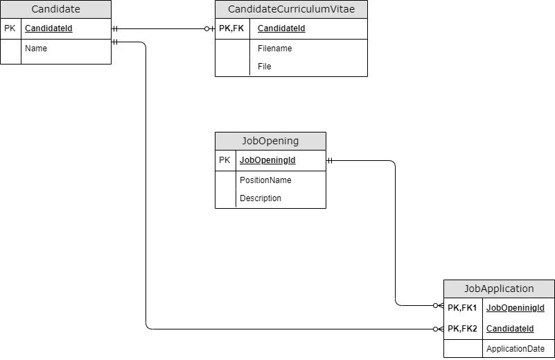

# Web API para o sistema ATS.

## Docker

Para subir o servidor, executar na raiz do projeto:
```
docker compose up
```

A porta utilizada é a 8080.

## Swagger

O swagger está habilitado, basta acessar a url `http://localhost:8080/swagger/`

## Testes Postman

O arquivo `.json` está localizado no diretório `Postman`.

Para rodar os testes, é necessário definir a variável `{{url}}` com a url sem o caminho. Por examplo: `http://localhost:8080`

## Modelagem



## Banco de dados

Foi utilizado o sqlite como banco de dados. Ele é criado automaticamente ao inicializar a aplicação pela primeira vez.

`ats.db` é o arquivo que contém o bando de dados.

## CRUD

Os endpoints sao:

`api/Candidate` para Candidatos. Possui o CRUD completo mais um endpoint para fazer o download apenas do Currículo.

`api/JobOpening` para Vagas. Possui o CRUD completo mais dois endpoints. Um para listagem de Candidatos para determinada vaga e outra para o Candidato se candidatar a uma vaga.

`api/JobApplication` foi criado apenas para a leitura (Read) de uma Candidatura.

O swagger possui documentação de cada endpoint.